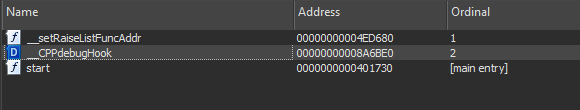
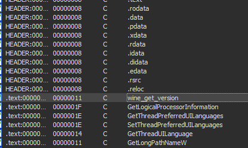
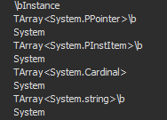

# aurora stealer reverse engineered

## 00-introduction

hi, this is my write up on the so-called "Aurora Stealer" malware, specifically focusing on the reverse engineering of it. let's start with how i found that malware.

this also happens to be my first write-up, so if you see any gramatical errors, please open up an issue and tell me about them. but let's go back to the story.

-----

at the **13th of february, 2023**, my friend messaged me the following

> BRo

>I FUCKING THINK THAT GOOGLE BAITED ME ONTO GETTING IVRUS+

-----
following those messages, we got in a call and he explained the whole situation to me: he was trying to download pycharm, however, there was a false *and obviosuly malicious* advertisement for pycharm from a random domain 

```https://download.meetquarry.click/?keyword=pycharm&source=bobaS1_CO&gclid=CjwKCAiA3KefBhByEiwAi2LDHHNVzdo2KRD7Dg8VrlZnCjJQZXdoO6zgyB9QkN8J9WLwo0srFmx7ZxoCEJkQAvD_BwE```.

the page was a really good replica of a legitimate jetbrains page, however, when i tried to click the link, it bounced me to a fake page consisting of something cargo shipping related. 
 
at this point in time, i had absolutely no idea what the malware was nor what capabilities it had, so i begun by trying to do static analysis on the Setup_x64.exe with ida 7.7.

-----
## 01-setup-analysis
-----

as soon as i opened the file, i looked at the export table. immediately, i noticed `__CPPdebugHook` export.



-----
from that i assumed that static analysis could be useless, however i still kept going at it. looking at the strings in the binary, i noticed `wine_get_version` string, and assumed that it was some sort of anti-debugging import or a app function name.




-----
as of the time i'm writing this document, i noticed that the setup binary uses some .NET package names in some generic type strings, so it could be a ahead-of-time-compiled C# binary. unfortunately, during the initial analysis, i never noticed that. anyways, going back on track



-----

after looking thru strings and not noticing anything suspicious, we decided to try runtime debugging using x64dbg, specifically putting breakpoints on some functions like `isDebuggerPresent`, `VirtualAlloc`/`Dealloc`, and `HeapFree`.

however, we forgot about the anti-debugging capabilities, and *did not* install scyllahide initially. after 3 attempts i've realized that and told my friend (who was already infected) to install scyllahide.


but we still did not notice anything, so we decided to single step thru the application and look at which handles it has. during one of the attempts, my friend looked in the app directory and noticed Unpacked.exe, the actual malware itself.

-----

as he does not understand any reverse engineering nor runtime debugging, i asked him to send the binary to me so i would statically analyse it. after receiving the binary, discord immediately deleted it because their malware analysis service detected it as malicious, however in the 3 seconds it was alive i managed to download it.

however before starting the reverse engineering of that binary, i told my friend to immediately reinstall windows because the application was using a custom RunPE loader, which is usually present in malware to avoid detection.

with that said, let's jump straight to unpacked malware itself.

-----
## 02-unpacked-analysis
-----

when i initially loaded the file into ida, i got a "damaged import section" message box, at the time i had no idea what it could mean because i did not check the import section of the loader, which had `LoadLibrary()` imported.

first of all, i looked at the strings and noticed that there are go source file string for both the go std, `x/sys@v0.2.0` package, and the malware itself: 

`.rdata:000000000060BCFD	00000027	C	/root/LIc/builder/cache/KE1002/main.go`

-----

because of those findings, i decided to use a few IDAPython scripts on the binary to remap function names to their original names, as well as recovering PCLN (which basically serves as debug information table), trying to use a script for proper strings recovery (this went unsuccessfully, strings are kind of garbled but still are readable), and structs/types recovery.

from this point on, i will use the [original ida database](assets/00-aurora-stealer/Unpacked.exe.malware.i64) i got during initial analysis, and will not attempt to recreate the steps.

-----

let's ignore the functions for now, and look straight at strings.  
searching for appdata, we can see that the malware grabs telegram's tdata (basically telegram session)

```
.rdata:00000000005CDB49	0000002E	C	ToNtPathName_U_WithStatus\\AppData\\Roaming\\Tele
.rdata:00000000005CDB77	0000002E	C	gram Desktop\\tdataheapBitsSetTypeGCProg: small
```
-----

searching more for `AppData` string literal, we can see the following

```
.rdata:00000000005C6E8F	00000024	C	rMultipleObjects\\AppData\\Roaming\\Zca
.rdata:00000000005C6EB3	00000018	C	sh\\User Data\\Local State
```

```
.rdata:00000000005C785C	00000024	C	\", missing CPU support\n\\AppData\\Roam
.rdata:00000000005C7880	00000021	C	ing\\Armorybytes.Buffer: too large
```

```
.rdata:00000000005C8835	0000002E	C	Time\\AppData\\Roaming\\bytecoin\\Opera Stable\\Loc
.rdata:00000000005C8863	00000008	C	al State
```

```
.rdata:00000000005CC09A	0000002E	C	\\AppData\\Roaming\\Electrum\\walletsbase outside 
```

```
.rdata:00000000005CD349	0000002E	C	fications\\AppData\\Roaming\\Exodus\\exodus.wallet
```

```
.rdata:00000000005CC64D	0000002E	C	VirtualQuery for stack base failed\\AppData\\Roa
.rdata:00000000005CC67B	0000002E	C	ming\\Ethereum\\keystorecrypto/rsa: missing publ
```

```
.rdata:00000000005CED0E	0000002E	C	ppData\\Roaming\\Guarda\\Local Storage\\leveldb\\Ap
.rdata:00000000005CED3C	0000002E	C	pData\\Roaming\\atomic\\Local Storage\\leveldbbufi
```

```
.rdata:00000000005CE6F3	0000002E	C	unexpected signal during runtime execution\\App
.rdata:00000000005CE721	0000002E	C	Data\\Roaming\\com.liberty.jaxx\\IndexedDBedwards
```

```
.rdata:00000000005C11FB	0000000A	C	\\Documents
.rdata:00000000005C1205	0000000A	C	\\User Data
```

so yeah, not only this grabs social networks, but also crypto wallets and local storage of opera + some other chromium browsers. before that tho, let me show you something


```
.rdata:00000000005C418D	00000020	C	119209289550781255.34.180.208:80
.rdata:00000000005C41AD	00000020	C	8159604644775390625: missing met
```

gotcha! we managed to find the ip address for the server that hosts malware backend: **55.34.180.208:8081**. unfortunately, this ip is not pinging for me, neither it was when i initially discovered the malware, so i did not try to do anything with it.

----

based on the strings alone, this is 100% malicious application. i would go more in depth about Grab() function disassembly, however, it's kinda pointless as i've shown you, the reader, most interesting things.

it also grabs a screenshot of your desktop, possibly grabs steam session, grabs something from/writes something to windows.old and temp, grabs your hardware id, grabs chrome(ium) passwords/cookies, your windows username, and sends that all to a server over a TCP socket.

-----

## 03-the-aftermath

getting to this stage in reverse engineering aurora stealer took me about 28 hours in total (including breaks and 16 hour long sleep), this malware is certainly interesting.

what can you derive from it? depends on who you are - a reverse engineer, a malware/code obfuscator/antimalware software developer, or an end user - in the first two cases you learn some neat stuff about golang compiler and language, in the latter case you learn more about internet safety and not downloading something without checking the url.

i've attached the malware ida database, however, i will not attach either runpe loader nor malware.exe itself as you might accidentally run it.

with that said, i don't think there's anything else to say, thank you for reading this write up, may luck be with you.

- indexregister / ffi - writing